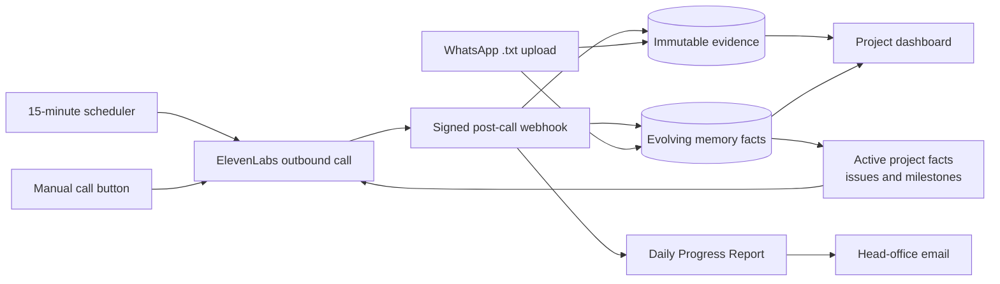

# FieldBrief

FieldBrief is an internal construction project-intelligence system. It calls each site's nominated team every day, collects a bilingual English/Hindi/Hinglish progress update, turns completed calls into a Daily Progress Report (DPR), emails head office, and compounds verified facts into a project-level company brain. A WhatsApp `.txt` export can be imported into the same evidence trail.

The app ships with a populated read-only demo. It becomes live when PostgreSQL, an ElevenLabs phone number, webhook signing, and email delivery are configured.

## What is included

- Portfolio dashboard with project, region, status, and search filters
- Project command view with progress versus plan, milestones, risks, team calls, and DPR coverage
- English/Hindi/Hinglish ElevenLabs agent designed for interruptions and noisy construction sites
- Daily call scheduler and manual site-team dispatch
- Signed, idempotent ElevenLabs post-call webhook processing
- Automatic DPR composition and idempotent Resend email delivery
- Evidence-backed company brain with active/resolved/superseded facts, confidence, owners, due dates, and source links
- Android and iPhone WhatsApp `.txt` parsing, multiline/Hindi support, duplicate-import protection, and 5 MB limits
- Optional Basic Auth, cron authentication, source provenance, and data-retention controls

## How it works



Each extracted fact is separate from its evidence. Repeated evidence raises the fact's evidence count; explicit resolution language may resolve a closely matching issue, while the original transcript or WhatsApp line remains immutable. The next call receives the highest-priority active facts, open issues, prior contact summary, and upcoming milestones as dynamic context.

## Local demo

Requirements: Node.js 20+ and pnpm 9+.

```bash
pnpm install
cp .env.example .env.local
pnpm dev
```

Open `http://localhost:3010`. With an empty `DATABASE_URL`, the dashboard uses seeded demonstration data, dispatches simulated calls, previews WhatsApp extraction without persisting it, and simulates DPR email delivery.

Run the verification suite:

```bash
pnpm typecheck
pnpm test
pnpm build
```

## Production setup

1. Provision PostgreSQL 15+ and put its connection string in `DATABASE_URL`.
2. Run `pnpm db:setup`. Optionally run `pnpm db:seed`, then replace every example field.
3. Configure `ELEVENLABS_API_KEY`, `ELEVENLABS_AGENT_ID`, `ELEVENLABS_PHONE_NUMBER_ID`, and `ELEVENLABS_WEBHOOK_SECRET`.
4. Configure ElevenLabs to send `post_call_transcription` events to `https://YOUR-DOMAIN/api/elevenlabs/webhook`.
5. Configure `RESEND_API_KEY`, a verified `DPR_FROM_EMAIL`, and each project's `report_recipients`.
6. Generate a strong `CRON_SECRET`. Vercel sends it to the scheduler as a Bearer token.
7. Set `APP_USERNAME` and `APP_PASSWORD`, or put the deployment behind company SSO/VPN.
8. Deploy to Vercel. `vercel.json` checks for due contacts every 15 minutes; each contact's timezone, `call_days`, and `call_time` control whether a call is due.

The ElevenLabs agent already created for this project is `agent_6601m069d01gfagtkfx8nh2ne9xz`. The supplied API key is stored only in the ignored local environment file and is not part of this repository. The agent-creation script is retained for versioned configuration; running it creates a replacement agent rather than updating the existing one.

To attach the phone number later:

- Import or connect the intended Twilio number in ElevenLabs.
- Copy its ElevenLabs phone-number ID into `ELEVENLABS_PHONE_NUMBER_ID`.
- Add each recipient's consented phone number to `project_contacts.phone_e164` in E.164 format, for example `+91XXXXXXXXXX`.
- Keep a number `NULL` or set `call_enabled = false` to exclude that person safely.

Current APIs used by this implementation are documented in the official [ElevenLabs outbound-call reference](https://elevenlabs.io/docs/api-reference/twilio/outbound-call), [post-call webhook guide](https://elevenlabs.io/docs/eleven-agents/workflows/post-call-webhooks), [dynamic variables guide](https://elevenlabs.io/docs/eleven-agents/customization/personalization/dynamic-variables), [Vercel cron guide](https://vercel.com/docs/cron-jobs/manage-cron-jobs), and [Resend send-email reference](https://resend.com/docs/api-reference/emails/send-email).

## Add a real site

`db/seed.example.sql` shows the required project, contact, milestone, and issue fields. Use stable, URL-safe text for `projects.id`. Store phone numbers in E.164 format and use IANA timezones. Calls are not attempted for contacts without a phone number.

The scheduling endpoint is:

```text
GET /api/cron/daily-calls
Authorization: Bearer $CRON_SECRET
```

Manual project dispatch is `POST /api/calls/dispatch` with `{ "projectId": "..." }`. The dashboard calls this route directly and is covered by the same Basic Auth gate when configured.

## WhatsApp import

From the project page, open **Company brain**, choose a WhatsApp export, review the preview, and import it. Export the group chat **without media** from WhatsApp; both common Android (`DD/MM/YYYY, HH:mm - Name: message`) and iPhone (`[DD/MM/YYYY, HH:mm:ss] Name: message`) formats are accepted.

Imports are scoped to the selected project and deduplicated by SHA-256 content hash. The raw file is parsed in memory; normalized messages and cited facts are stored in PostgreSQL. Media placeholders and system messages are ignored. The deterministic extractor recognizes progress, blockers, commitments, safety, material/equipment, and resolution language in English/Hinglish/Hindi. Review important extracted facts in the dashboard before relying on them operationally.

## Data and safety decisions

- Voice and WhatsApp sources remain immutable; memory facts change status instead of rewriting history.
- Webhooks require HMAC verification in production and are deduplicated before processing.
- DPRs retain the exact ElevenLabs conversation IDs used to create them.
- Calls explicitly disclose recording in the first message. Obtain organizational and participant consent, define an India-specific retention policy, and complete legal/security review before rollout.
- The created ElevenLabs agent currently retains audio/transcripts for 365 days. Reduce this in ElevenLabs if company policy requires it.
- Use SSO/VPN and role-based access before broad deployment; Basic Auth is intended for a small controlled pilot.
- Urgent safety events are escalated to the site's human emergency process. The agent does not provide medical or legal advice.

## Repository map

```text
src/app/                    dashboard and API routes
src/lib/elevenlabs.ts       outbound calls, webhook verification and parsing
src/lib/memory-repository.ts evidence and evolving company-brain facts
src/lib/reporting.ts        deterministic DPR composition
src/lib/whatsapp.ts         WhatsApp parser and fact extraction
db/schema.sql               PostgreSQL schema
scripts/                    database and ElevenLabs setup utilities
tests/                      parser, webhook, signature, and DPR tests
```

## Remaining configuration

No real calls or emails can be sent until the intended ElevenLabs phone-number ID, site contacts, PostgreSQL URL, head-office email, Resend key, and production webhook secret are supplied. The dashboard remains fully usable in demo mode meanwhile.
